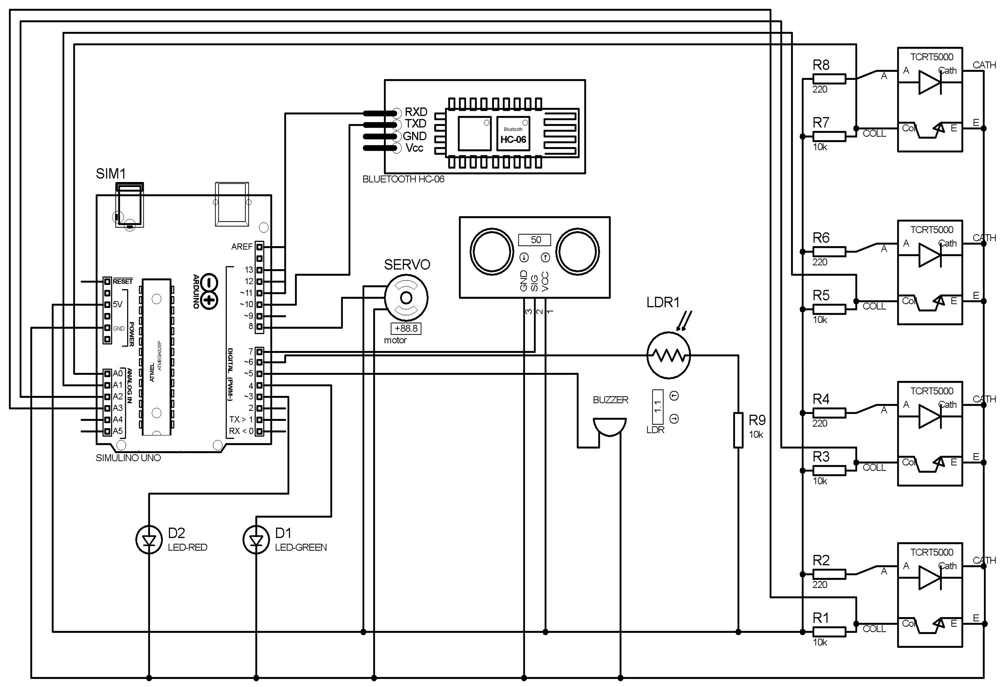

# Introduction
This project presents the architecture of a low-cost smart vault security and monitoring system. With the help of accessible sensors like Bluetooth modules and IR arrays, as well as inexpensive Arduino UNO microcontrollers for use as a communication channel between the devices, an Internet of Things (IoT)-based security vault system that enables users to monitor and safely store important items and documents for use in homes and businesses has been developed. This system presents a potential zero user interface (UI) touchless technical solution utilizing infrared signals and light-dependent resistance.

### Primary Collaborators:
- Afif Hassan Choudhury
- Md Razin

# System Design
Initially when the power is turned on the vault as well as its keypad will default to being locked. The first layer of security requires password through Bluetooth connection to access the secondary security system. The Bluetooth module will switch on and start looking for a nearby mobile device to pair with. To pair with the Bluetooth module the user needs to enter the pairing password. Two LEDs (green and red) are used to identify if the provided password is correct or not. Wrong password will activate a buzzer to alert surrounding people. Secondary layer is a keypad designed with IR Sensor-Array which requires ‘secret gesture pattern’ to access the door of the vault. Once the ‘secret gesture pattern’ is entered the user needs to press the LDR switch to confirm. Again, if the wrong password is entered from the keypad the alarm will go off along with the red led indicator. In addition, this system can count transactions of items inside the vault as a third layer security. In this mode, the LED indicators will count if an object is removed or kept inside the vault. If an object is kept inside, green LED will blink once and if an object is removed, the red LED will blink.

## Architecture

## Primary Components
-	Arduino UNO
-	Servo Motors
-	IR sensor-array
-	Bluetooth Module
-	Sonar Sensor
-	Buzzer
-	LDR

## Schematic diagram of the circuit

## Prototype Wiring

## Security Protocol
- ***First Layer:*** In this state the user needs to input a password via Bluetooth.
- ***Second Layer:*** In this state the user needs to input a gesture pattern on IR sensor array.
- ***Third Layer:*** In this state the object entering or exiting can be identified from the LED indicators.

## Prototype Demonstration

[Youtube](https://www.youtube.com/watch?v=dNWjNGSZIJ8)

https://github.com/user-attachments/assets/c0149397-cf38-439e-9e09-c32df0df45dd

### Citation:
M. H. C. Joy, M. M. A. Karim, A. H. Choudhury, M. Razin and S. N. M. Ahmed, "An IoT Based Smart Vault Security and Monitoring System with Zero UI," 2023 3rd International Conference on Robotics, Electrical and Signal Processing Techniques (ICREST), Dhaka, Bangladesh, 2023, pp. 95-100, doi: 10.1109/ICREST57604.2023.10070057. keywords: {Wiring;Bluetooth;Sonar;Signal processing algorithms;Switches;User interfaces;Robot sensing systems;Internet of Things;Automated Safety Vault;Smart Security System;Triple Layered Defense Mechanism;Password Verification;Electronic Lock;Security Features;Zero User Interface (UI);Touchless Technology},

